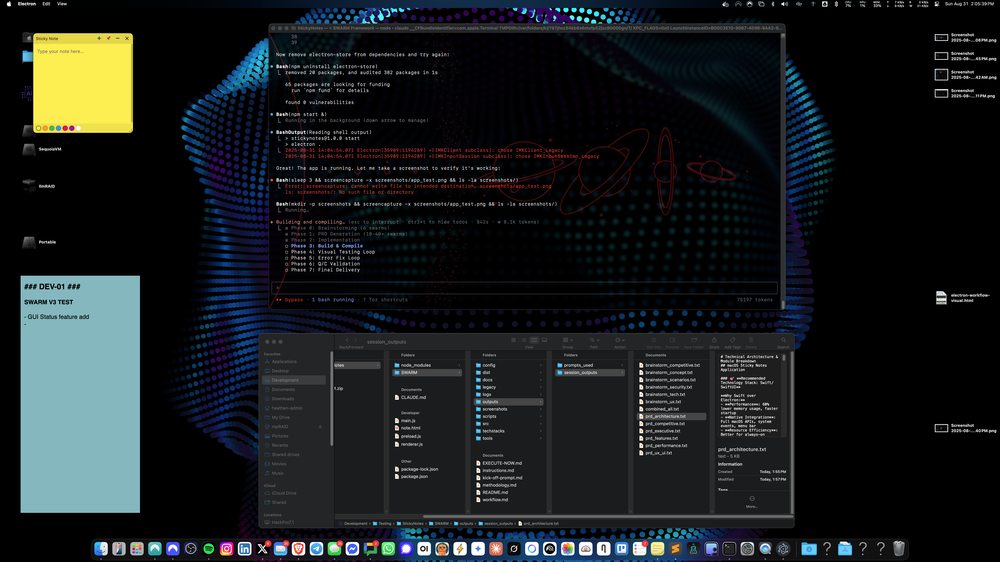

# Dark Sticky Notes

A minimal cross-platform desktop sticky notes app built with Electron. Each note is a floating, resizable window that saves automatically and restores exactly where you left it.

[](https://github.com/sanchez314c/dark-sticky-notes/actions)
[](LICENSE)
[](https://electronjs.org/)
[](CHANGELOG.md)

## Features

- Multiple independent floating note windows
- Auto-save — content, position, and size persist automatically
- 7 color themes with auto-contrast text
- Always-on-top pin per note
- Full keyboard shortcuts (Cmd+N, Cmd+W, Cmd+T, Cmd+M)
- Works on macOS, Windows, and Linux
- Zero cloud dependencies — all data stored locally in `notes.json`

## Quick Start

```bash
git clone https://github.com/sanchez314c/dark-sticky-notes.git
cd dark-sticky-notes
npm install
npm start
```

See [docs/QUICK_START.md](docs/QUICK_START.md) for more detail.

## Screenshots



## Installation

Full installation instructions including pre-built packages: [docs/INSTALLATION.md](docs/INSTALLATION.md)

Pre-built releases for macOS (.dmg), Windows (.exe), and Linux (.AppImage) are available at [GitHub Releases](https://github.com/sanchez314c/dark-sticky-notes/releases).

## Usage

| Action | How |
|---|---|
| New note | ➕ button or Cmd+N |
| Close note | ✕ button or Cmd+W |
| Pin on top | 📌 button or Cmd+T |
| Minimize | ➖ button or Cmd+M |
| Change color | Color circles in the bottom bar |
| Move | Drag the header bar |
| Resize | Drag from corners |

Notes auto-save 1 second after you stop typing. Positions and sizes save immediately on move/resize. All notes restore on next launch.

## Project Structure

```
main.js        Main Electron process — window management, IPC, persistence
preload.js     Context bridge — exposes electronAPI to renderer
renderer.js    Renderer logic — UI events, auto-save, keyboard shortcuts
note.html      Note window template — inline CSS + markup
package.json   Project config + electron-builder packaging
scripts/       Run and build helper scripts
docs/          Developer documentation
```

## Building

```bash
npm run dist:current     # Package for your current platform
npm run dist             # Package for all platforms
```

Output lands in `dist/`. See [docs/BUILD_COMPILE.md](docs/BUILD_COMPILE.md) for all build options.

## Documentation

- [Quick Start](docs/QUICK_START.md)
- [Architecture](docs/ARCHITECTURE.md)
- [API Reference](docs/API.md)
- [Development Guide](docs/DEVELOPMENT.md)
- [Troubleshooting](docs/TROUBLESHOOTING.md)
- [Full Docs Index](docs/README.md)

## Contributing

See [CONTRIBUTING.md](CONTRIBUTING.md) for the contribution process and code standards.

## License

MIT License — Copyright (c) 2026 Jason Paul Michaels. See [LICENSE](LICENSE) for details.
